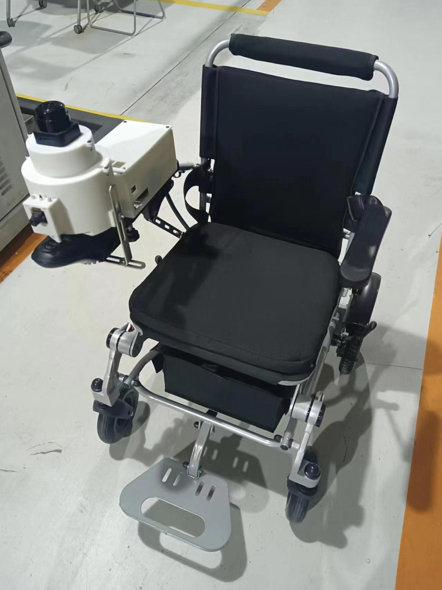
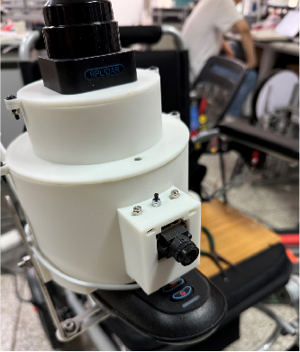

# 2024软件工程——轮椅嵌入队

展示视频


## 项目概述

本项目是一个为肢体运动障碍人士设计的电动轮椅拓展控制系统，致力于利用低成本手段实现普通电动轮椅的智能化改造，基于多传感器环境感知等技术为肢体障碍人士提供全新的出行方式。

本系统设计包括头部微动检测、环境感知和机械控制三个部分。其中，头部微动检测使用卡尔曼滤波算法来处理数据，提高系统状态估计的准确性；环境感知部分利用激光雷达实现自动避障；机械控制部分通过解耦设计，将轮椅控制器的复杂运动简化为更易于控制的形式。项目通过仿真实验和实机测试，验证了系统的有效性。

本产品最终实现了头部姿态控制轮椅运动、手机APP控制轮椅运动、自动避障、跟随运动与过速检测等功能。本系统适用于20多种品牌和型号的电动轮椅，操作简单且成本较低，具有普适性。相关技术已申请国家专利多项，并发表高水平期刊论文，展现出巨大的市场潜力。

## 项目介绍

### 硬件结构





### 系统结构

**当前分支（main）为项目总代码，不同功能模块（软件、硬件、仿真等）的开发代码在各自的分支下。**

#### 文件目录

```bash
├── Android_App             # Android App源代码
├── OpenMV                  # OpenMV摄像头内部烧录的跟踪代码
├── pictures                # 展示图片
├── Uart_Servo              # 舵机驱动代码
├── app.apk                 # 手机APP打包文件，安装即可使用
├── wheel_chair_v3.0        # ROS端主代码
│   ├── build         
│   ├── devel             
│   ├── src                      # 功能包
│   │   ├── android              # 与app通信节点
│   │   ├── imu                  # 头部姿态感知模块
│   │   ├── main                 # 控制器模块
│   │   ├── openmv               # 跟踪模块
│   │   ├── rplidar_ros          # 雷达模块
│   │   ├── turtle               # 控制模块
│   └── ├── yahboomcar_laser     # 避障模块
└──
```

#### 系统架构


### 技术介绍

- 前端：`Android App`框架
- 数据库：`MySQL`。
- 机器人端：`ROS`，`RosBridge`，`ssh`。

## 环境配置

### 环境及软件需求

- Ubuntu 20.04 LTS
- ROS Noetic
- python 3.6
- MySQL 5.7

### 运行说明

- RosBridge运行在树莓派电脑`172.20.10.8:9090`，需要避免端口被占用。
- 进入ROS目录下，运行命令`roslaunch main lanunch.launch `启动ROS端服务。
- 手机APP与轮椅进行连接后，即可正常使用各个功能。
- 由于建图模式内存占用过多，需要单独启动`ros_launch rplidar_ros test_gmapping.launch`

### APP说明


* 点击连接设备与轮椅进行RosBridge连接
* 手动IP为手动配置轮椅树莓派的IP地址 ，默认为172.20.10.8
* 重置IP为将树莓派IP地址恢复为默认地址
* 状态查询是查询当前连接状态
* 系统更新是更新为最新代码
